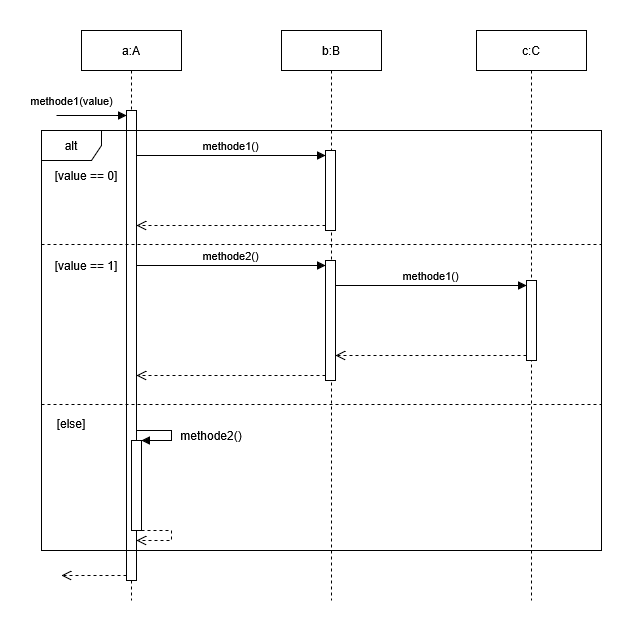

# Aufgabe 1 - Sequenzdiagramm

Gegeben sind folgende Klassen und ihre Verwendung im Hauptprogramm.

Zeichne ein Sequenzdiagramm für den Aufruf `customer.perform_withdrawal(50)`.


```python
class BankAccount:
    def __init__(self, owner):
        self.owner = owner
        self.balance = 0

    def deposit(self, amount):
        self.balance += amount
        print(f"{amount} eingezahlt. Neuer Kontostand: {self.balance}")

    def withdraw(self, amount):
        if self.balance >= amount:
            self.balance -= amount
            print(f"{amount} abgehoben. Neuer Kontostand: {self.balance}")
        else:
            print("Nicht genügend Guthaben")

class ATM:
    def __init__(self, account):
        self.account = account

    def withdraw_money(self, amount):
        print("ATM: Abhebung wird durchgeführt...")
        self.account.withdraw(amount)

class Customer:
    def __init__(self, name, account, atm):
        self.name = name
        self.account = account
        self.atm = atm

    def perform_withdrawal(self, amount):
        print(f"{self.name} möchte {amount} abheben")
        self.atm.withdraw_money(amount)


# Hauptprogramm
account = BankAccount("Max")
account.deposit(100)

atm = ATM(account)
customer = Customer("Max", account, atm)

customer.perform_withdrawal(50)
```

# Aufgabe 2 - Sequenzdiagramm mit Alternative

Gegeben sind folgende Klassen und ihre Verwendung im Hauptprogramm.

Zeichne ein Sequenzdiagramm für den Aufruf `anne.freitag_starten()`. Benutze das `alt`-Fragment, um alternative Abläufe darzustellen.

```python

class CocktailEnthusiast:
    def __init__(self, bar):
        self.bar = bar

    def freitag_starten(self):
        # ...
        self.cocktails_trinken()
        # ...
    
    def cocktails_trinken(self):
        # ...
        promille = self.bar.mojito()

        if promille > 1.0:
            self.verabschieden()
        else:
            self.bar.long_island_ice_tea()
        # ...
    
    def verabschieden(self):
        # ...
        return

class Cocktailbar:
    def mojito(self):
        return ...
    
    def long_island_ice_tea(self):
        # ...
        return
    
    def eierlikör(self):
        # ...
        return

bar1 = Cocktailbar()
anne = CocktailEnthusiast(bar1)

anne.freitag_starten()
```

# Aufgabe 3 - Sequenzdiagramm mit Alternative

Gegeben sind folgende Klassen und ihre Verwendung im Hauptprogramm.

Zeichne ein Sequenzdiagramm für den Aufruf `customer.perform_withdrawal()`. Benutze das `alt`-Fragment, um alternative Abläufe darzustellen.

```python
class BankAccount:
    def __init__(self, owner):
        self.owner = owner
        self.balance = 0

    def deposit(self, amount):
        self.balance += amount
        print(f"{amount} eingezahlt. Neuer Kontostand: {self.balance}")

    def withdraw(self, amount):
        if self.balance >= amount:
            self.balance -= amount
            return True
        else:
            return False


class ATM:
    def __init__(self, account):
        self.account = account

    def withdraw_money(self, amount):
        print("ATM: Abhebung wird durchgeführt...")
        success = self.account.withdraw(amount)

        if success:
            self.dispense_cash(amount)
        else:
            self.show_error()

    def dispense_cash(self, amount):
        print(f"{amount}€ werden ausgezahlt.")

    def show_error(self):
        print("Nicht genügend Guthaben!")


class Customer:
    def __init__(self, name, atm):
        self.name = name
        self.atm = atm

    def perform_withdrawal(self, amount):
        print(f"{self.name} möchte {amount}€ abheben")
        self.atm.withdraw_money(amount)


# Hauptprogramm
account = BankAccount("Max")
account.deposit(100)

atm = ATM(account)
customer = Customer("Max", atm)

customer.perform_withdrawal(50)
```

# Aufgabe 4

Schreibe die Klassen `A`, `B` und `C` und deren Methoden, die durch folgendes Sequenzdiagramm beschrieben werden:

